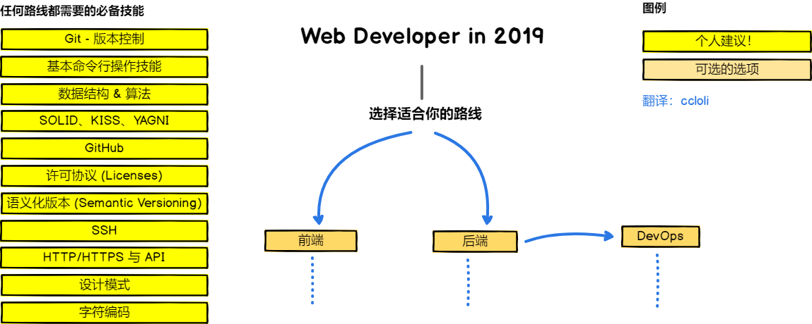

# 零基础成为前端开发者
## 一、路线图
对于零基础的同学，想转行做前端开发工程师，最好的方式其实公司内部转岗，在实践中成长是最快。

但只有系统性的学习才能让你走的更远，这方面的最好方式，就是找最资深的人指导你学习方向。

对！是方向！这里我找了一张国外很不错的学习路线图，这是作者网站：https://roadmap.sh/frontend

下面有热心网友翻译的中文版：

## 二、学习资源
### 免费的课程
- [《ES6 快速入门》](https://www.imooc.com/learn/955)-慕课网（1小时25分钟）

针对已经有JavaScript的基础的同学，可以通过这个课程快速了解 ES6 语法的核心。

不过中间有一节视频讲环境搭建（Weppack）的，我认为对于这门课是多余的（反正我就没有按他的做），因为之后的课程内容，即使没有环境搭建，你也能够在自己的电脑实现视频里的代码。

- [《用 Git 进行版本控制》](https://cn.udacity.com/course/version-control-with-git--ud123)-优达学城

优达学城的这门 Git 入门课程，是我见过对新手最友好的教程，不管是体验还是内容。

每个视频只讲一个点，时长控制在 3 分钟以内，看完就能够在自己的电脑去实现，真正的从课程设计上，让人感受到「手把手教你」的服务。官方虽然显示学习时长为4周，但实际上，我用了一天时间就学完，以及整理了笔记。

- [《GitHub 协作》](https://cn.udacity.com/course/github-collaboration--ud456)-优达学城

学完《用 Git 进行版本控制》后，可以再了解一下如何用 GitHub 进行协作，这不是必要的，不过这门课时长也很短，甚至可以当成下饭剧把它消灭（我就是这么做的）。

- [《vue2.5 入门》](https://www.imooc.com/learn/980)-慕课网（2小时13分钟）

快速上手 Vue 的课程，在我看过慕课网讲师中，讲课思路最清晰的之一。

通过带你上手两个小案例，讲解 Vue 的基础语法及编程思路。甚至，如果此前你已经有过独立开发项目的经历，完全可以通过 Vue 官方文档来学习。（嗯！Vue 的官方文档对中文第一友好）

- [《轻松入门微信小程序与云开发》](https://www.imooc.com/learn/1121)-慕课网（3小时31分）

学习小程序开发入门课程，尤其你希望做一个自己的小程序，云开发的章节就很有用。

学完以后，直接零成本创造一个线上运行的小程序，我自己就写了一个，微信搜索「里程碑 LikeDay」可以找到。

